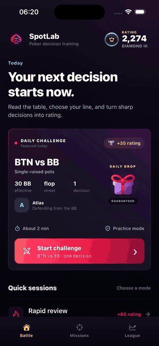

# SpotLab

**Train the spot. Master the decision.**

SpotLab is a mobile poker decision trainer built with Expo and React Native. It turns focused poker situations into short practice sessions: read the table, choose a line, review the strategy, and build a measurable performance profile.

> The current practice engine uses deterministic strategy fixtures. Frequencies and EV values are educational product data, not solver-verified GTO advice.

## Product tour

[](docs/media/spotlab-product-tour.mp4)

Follow one complete training loop—from choosing a line through solver-style feedback and range exploration—then browse mission filters and league progression. [Open the full-quality recording](docs/media/spotlab-product-tour.mp4).

## Product

SpotLab is organized around three destinations:

- **Battle** presents the daily challenge and fast practice modes.
- **Missions** filters a library of preflop, flop, turn, and river scenarios.
- **League** tracks rating, EV loss, skill areas, recent decisions, and promotion progress.

Each training hand follows an explicit lifecycle:

```text
Choose → Submit → Analyze → Review → Continue
```

The table preserves poker context throughout the loop: positions, effective stack, pot, board, action history, legal actions, bet sizing, and the dealer button remain visible and accessible.

## Highlights

- Responsive six-seat poker table with native cards, seats, chips, and board state
- Ten typed practice scenarios across MTT and cash-game filters
- Contextual fold, check, call, bet, and raise controls with exact BB sizing
- Staged analysis progress and normalized strategy responses
- EV comparison, mixed-strategy frequencies, coaching, and a 13×13 range explorer
- Persistent rating, recent decisions, skill summaries, and mission completion
- Haptic and audio feedback with reduced-motion support
- Runtime validation at the solver boundary using Zod
- Explicit trainer state transitions using Zustand
- Cached server-style state using TanStack Query

## Technology

- Expo SDK 57 and React Native 0.86
- Expo Router
- TypeScript
- React Native Reanimated
- React Native SVG and Lucide icons
- TanStack Query
- Zustand
- AsyncStorage
- Jest and Testing Library

## Getting started

Requirements:

- A current Node.js LTS release supported by Expo SDK 57
- npm
- Expo Go, an iOS simulator, or an Android emulator

```bash
npm ci
npm start
```

Platform shortcuts:

```bash
npm run ios
npm run android
npm run web
```

## Quality checks

```bash
npm run typecheck
npm run lint
npm test
npx expo-doctor
```

The test suite covers decision grading, poker-data plausibility, streamed analysis ordering, response normalization, trainer transitions, persistence, and performance aggregation.

## Project structure

```text
app/                     Expo Router routes
src/
  components/            Shared UI and game primitives
  design-system/         Color, typography, spacing, motion, and art tokens
  features/
    home/                Battle lobby
    trainer/             Missions, live decisions, feedback, and range lab
    performance/         League and player progress
  providers/             Application providers and query client
  services/              Practice engine and persistence boundaries
  types/                 Poker domain model
  utils/                 Decision grading utilities
__tests__/               Domain, state, and service tests
docs/                    Product, architecture, and licensing documentation
```

Route files stay deliberately thin. Poker behavior, persistence, service boundaries, and presentation components live in feature and service modules rather than inside navigation.

## Documentation

- [Product guide](docs/PRODUCT_GUIDE.md)
- [Architecture](docs/ARCHITECTURE.md)
- [Third-party assets](docs/THIRD_PARTY_ASSETS.md)

## Service evolution

The UI consumes a typed `SolverClient` contract. A remote implementation can preserve that interface while adding authenticated jobs, cancellation, SSE or WebSocket progress, contract telemetry, and backend-mediated coaching. Provider credentials must never ship in the mobile bundle.

Progression is currently stored locally with AsyncStorage. Account-backed sync can replace that implementation behind the existing performance service boundary.
